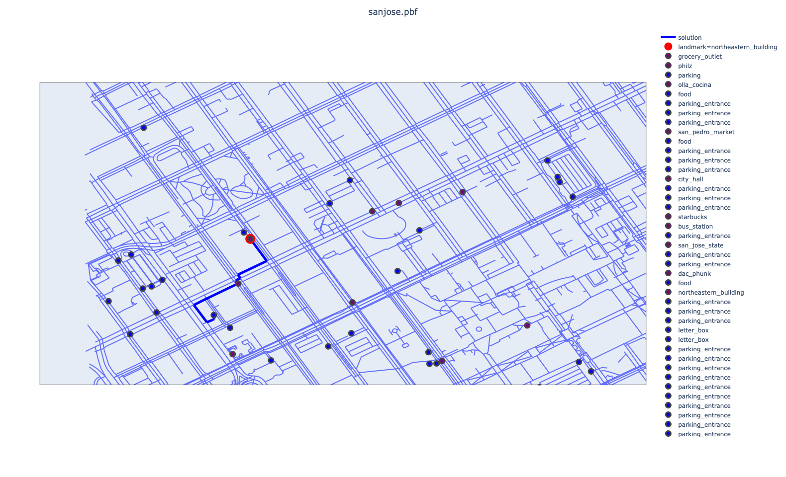
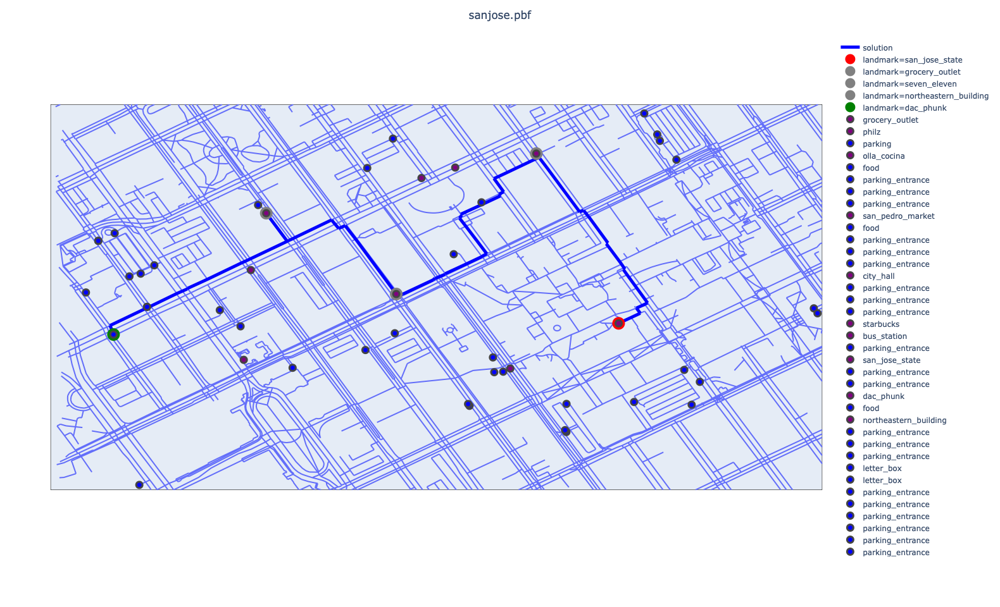

# Assignment 1

**Name**: Derek Zhang  
**NUID**: 001458122

**Complete Code Implementation:**
[submission.py](./Starter%20Code%20and%20Data/submission.py)


## 1. Route Planning: Grid City

### 1.1 Minimal Cost Analysis
In order to have the minimal cost to reach from (0,0) to (m,n), we need to find the shortest path through a grid city where:
- We can move in four directions: east, north, west, and south
- Horizontal movement cost: `Cost((x,y), a) = 1 + max(x,0)`
- Vertical movement cost: Always 1

The total horizontal cost from origin to destination `(m):
0, 1, 2, 3, ..., m-1. => m + m(m-1)/2`

### 1.2 Cost Calculations
- Horizontal cost: `m(m-1)/2`
- Vertical cost: `n`
- Total cost: `m + m(m-1)/2 + n`

### 1.3 Path Uniqueness
The minimal cost path is not unique. Any path with exactly m horizontal steps and n vertical steps achieves the same minimal cost.

## 2. Route Planning: San Jose

### 2.1 Implementation Details
Code implementation in `submission.py`

### 2.2 Path Analysis
Testing different paths through San Jose revealed:

```python
# Example valid path configuration
startLocation = locationFromTag(makeTag("landmark", "northeastern_building"), cityMap)
endTag = "parking=underground"
```

**Note**: Some paths may be invalid due to map limitations.

## 3. Route Planning: Unordered Waypoints

### 3.1 Implementation
Code is in the code `submission.py`

### 3.2 State Space Analysis
There are n possible locations, and k waypoint tags that can generate up to 2^k possible states.
So, the maximum possible number of states that UCS could visit is n * 2^k.

### 3.3 Example Configuration
```python
startLocation = locationFromTag(makeTag("landmark", "san_jose_state"), cityMap)

# Define the waypoint tags
waypointTags = [
    makeTag("landmark", "grocery_outlet"),
    makeTag("landmark", "seven_eleven"),
    makeTag("landmark", "northeastern_building"),
]

# Define the end tag
endTag = makeTag("landmark", "dac_phunk")
```


## 4 Route Planning: Speeding up Search with A*
4.1 Implementation
Code is in the code `submission.py`

4.2 Implementation
Code is in the code `submission.py`